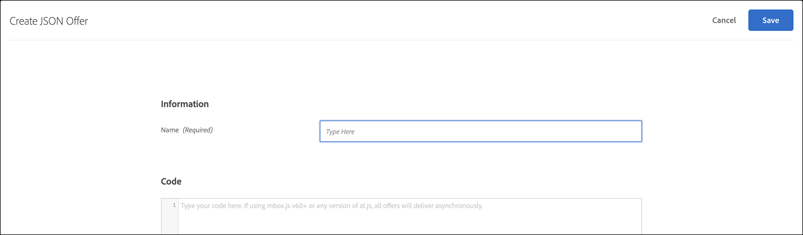
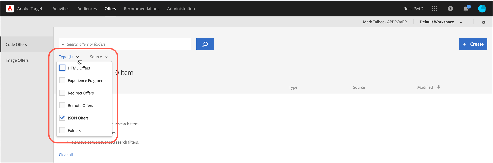

# Create JSON offers{#create-json-offers}

Create JSON offers in the [!UICONTROL Offer Library] in [!DNL Adobe Target] for use in the [!UICONTROL Form-Based Experience Composer].

JSON offers can be used in form-based activities whereby enabling use cases where [!DNL Target]'s decisioning is required to send an offer in JSON format for consumption in SPA framework or server-side integrations.

## JSON considerations

Consider the following information as you work with JSON offers:

* JSON offers are currently available only for [!UICONTROL A/B Test] and [!UICONTROL Experience Targeting] (XT) activities. 
* JSON offers can be used in [form-based activities](/help/c-experiences/form-experience-composer.md) only. 
* JSON offer can be retrieved directly when you are using the Server Side API, Mobile SDK, or NodeJS SDK. 
* In the browser, JSON offers can be retrieved ONLY via at.js 1.2.3 (or later) and using [getOffer()](/help/c-implementing-target/c-implementing-target-for-client-side-web/adobe-target-getoffer.md) by filtering actions using the `setJson` action. 
* JSON offers are delivered as native JSON objects rather than as strings. Consumers of these objects are no longer required to handle objects as strings and convert them to JSON objects. 
* JSON offers are not applied automatically as opposed to other offers (such as HTML offers) because JSON offers are non-visual offers. Developers must write code to explicitly get the offer using [getOffer()](/help/c-implementing-target/c-implementing-target-for-client-side-web/adobe-target-getoffer.md). 
* JSON offers are not supported if you are using mbox.js.

## Create a JSON offer {#section_BB9C72D59DEA4EFB97A906AE7569AD7A}

1. Click **[!UICONTROL Offers]** > **[!UICONTROL Code Offers]**.

   
   
1. Click **[!UICONTROL Create]** > **[!UICONTROL JSON Offer]**.

   

1. Type an offer name. 
1. Type or paste your JSON code in the **[!UICONTROL Code]** box. 
1. Click **[!UICONTROL Save]**.

## JSON example {#section_A54F7BB2B55D4B7ABCD5002E0C72D8C9}

JSON offers are supported only in activities created using the [Form-Based Experience Composer](/help/c-experiences/form-experience-composer.md). Currently the only way to be able to use JSON offers is via direct API calls.

Here is an example:

```json
adobe.target.getOffer({ 
  mbox: "some-mbox", 
  success: function(actions) { 
    console.log('Success', actions); 
  }, 
  error: function(status, error) { 
    console.log('Error', status, error); 
  } 
});
```

The actions passed to success callback is an array of object. Assuming that we have a single JSON offer, that has this content:

```json
{ 
  "demo": {"a": 1, "b": 2} 
}
```

The actions array will have this structure:

```json
[ 
 { 
   action: "setJson", 
   content: [{ 
     "demo": {"a": 1, "b": 2} 
   }] 
 }  
]
```

To extract the JSON offer you iterate through actions and find the action with the `setJson` action and then iterate through the content array.

## Use case {#section_85B07907B51A43239C8E3498EF58B1E5}

Let's say the following JSON offer gets delivered to your web page:

```json
{ 
    "_id": "5a65d24d8fafc966921e9169", 
    "index": 0, 
    "guid": "7c006504-c6f7-468d-a46f-f72531ea454c", 
    "isActive": true, 
    "balance": "$2,075.06", 
    "picture": "https://placehold.it/32x32", 
    "tags": [ 
      "esse", 
      "commodo", 
      "excepteur", 
    ], 
    "friends": [ 
      { 
        "id": 0, 
        "name": "Carla Lyons" 
      }, 
      { 
        "id": 1, 
        "name": "Ollie Mooney" 
      }, 
    ], 
    "greeting": "Hello, Stephenson Fernandez! You have 4 unread messages.", 
    "favoriteFruit": "strawberry" 
} 
  
```

The following code shows how to access the "greeting" attribute:

```json
adobe.target.getOffer({   
  "mbox": "name_of_mbox", 
  "params": {}, 
  "success": function(offer) {           
        console.log(offer[0].content[0].greeting); 
  },   
  "error": function(status, error) {           
      console.log('Error', status, error); 
  } 
});
```

## Filtering offers by the JSON offer type {#section_52533555BCE6420C8A95EB4EB8907BDE}

You can filter the [!UICONTROL Offers] library by the JSON offer type by clicking the **[!UICONTROL Type]** drop-down list, then by selecting the **[!UICONTROL JSON]** checkbox.



