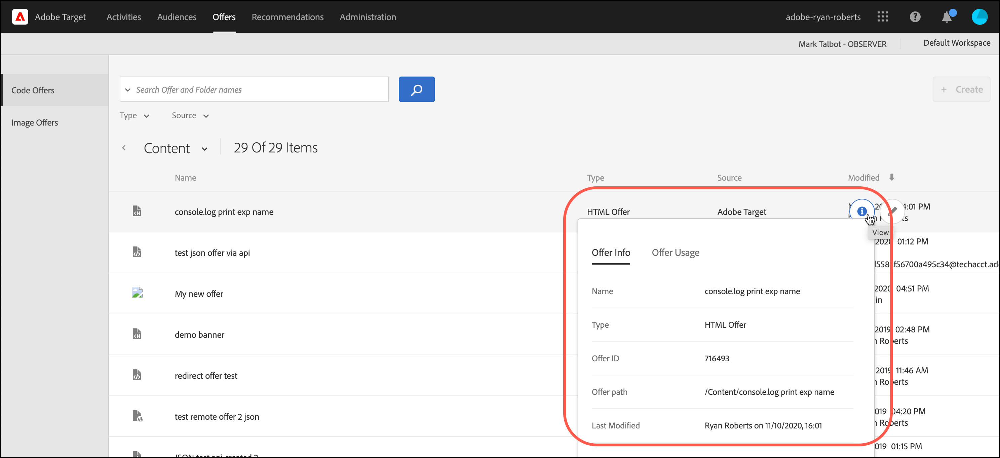
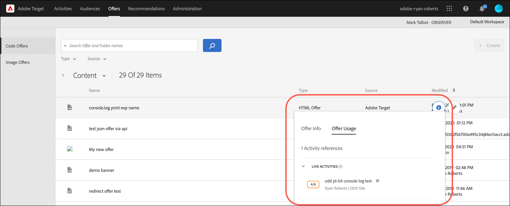
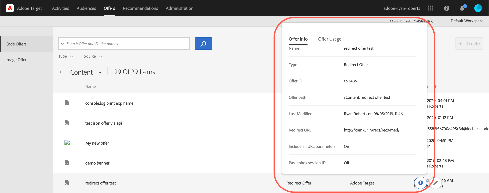
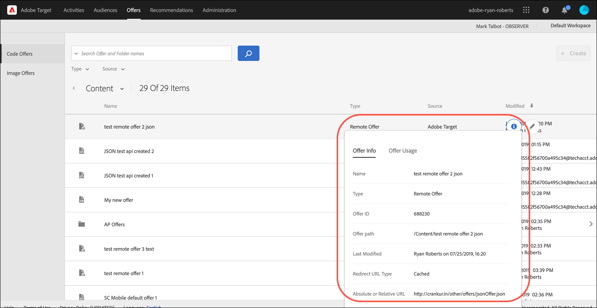

# Offers

Use the [!UICONTROL Offers] library in [!DNL Adobe Target] to manage your code offer and image offer content.

1. Click **[!UICONTROL Offers]** to open the library.

   The library contains the offers that have been set up via [!DNL Target Standard/Premium], [!DNL Target Classic], [!DNL Adobe Experience Manager] (AEM), [!DNL Adobe Mobile Services] (AMS), and APIs. Offers created in [!DNL Target Classic] or other solutions are editable in [!DNL Target Standard/Premium].

   The [!UICONTROL Offers] page has two tabs along the right side: [!UICONTROL Code Offers] and [!UICONTROL Image Offers] that let you view offers by type.

   

1. (Optional) Click the **[!UICONTROL Type]** drop-down list to filter offers by type (HTML Offer, [Experience Fragments](/help/c-experiences/c-manage-content/aem-experience-fragments.md), [Redirect Offer](/help/c-experiences/c-manage-content/offer-redirect.md), [Remote Offer](/help/c-experiences/c-manage-content/about-remote-offers.md), [JSON Offers](/help/c-experiences/c-manage-content/create-json-offer.md), and [Folders](/help/c-experiences/c-manage-content/create-content-folder.md)).

   

1. (Optional) Click the **[!UICONTROL Source]** drop-down list to filter offers by source (Adobe Target, Adobe Target Classic, and Adobe Experience Manager).

1. (Optional) Perform additional tasks by hovering over the desired offer or folder on the [!UICONTROL Code Offers] tab, then by clicking the desired icon.

   

   Options include:

   * View (For more information, see [Viewing offer definitions](#section_6B059DD121434E6292CAB393507D010E) below.)
   * Edit
   * Copy
   * Move (For example, to move one or more items into a folder, click the **[!UICONTROL Move]** icon for the desired item, click the desired folder, then click **[!UICONTROL Drop]**.)
   * Delete

   Depending on your permissions, you might not see icons for all options. For example, a user with [!UICONTROL Observer] permissions does not have the rights to use the [!UICONTROL Copy] option.

   For detailed information about the tasks you can perform on offers and folders, see [Work with content in the Asset library](/help/c-experiences/c-manage-content/assets-working.md).

1. (Optional) Perform additional tasks by hovering over the desired image offer or folder on the [!UICONTROL Image Offers] tab, then by clicking the desired icon.

   

   Options include:

   * Select
   * Download
   * View Properties
   * Edit
   * Annotate
   * Copy

   For detailed information about the tasks you can perform on offers and folders, see [Work with content in the Asset library](/help/c-experiences/c-manage-content/assets-working.md).

## Viewing offer definitions {#section_6B059DD121434E6292CAB393507D010E}

You can view offer definition details on a pop-up card in the [!UICONTROL Offers] library without opening the offer.

For example, the following offer definition card for an HTML offer is accessed by hovering over an offer on the [!UICONTROL Content] list, then clicking the information icon:

The following information is available:

* Name 
* Source 
* Type 
* Offer ID 
* Offer path 
* Last Modified

Click the [!UICONTROL Offer Usage] tab to view the activities that reference a code offer in each offer's definition pop-up card. This functionality does not apply to image offers. This way you can avoid impact to other activities while editing offers. Information includes [!UICONTROL Live Activities] and [!UICONTROL Inactive Activities].

The following offer definition card for a Redirect offer:

The following information is available:

* Name 
* Source 
* Type 
* Offer ID 
* Offer Path 
* Last Modified 
* Redirect URL 
* Include all URL parameters (On or Off) 
* Pass mbox session ID (On or Off)

The following offer definition card for a Remote offer:

The following information is available:

* Name 
* Source 
* Type 
* Offer ID 
* Offer Path 
* Last Modified 
* Redirect URL Type 
* Absolute or Relative URL

## Training video: The Content Repository 

This video includes information about managing offers.

* Connection between the [Experience Cloud Asset Library](https://experienceleague.adobe.com/docs/core-services/interface/assets/creative-cloud.html) and the Target Content Library 
* Custom HTML Offers 
* Custom HTML Offer in the Visual Experience Composer

>[!VIDEO](https://video.tv.adobe.com/v/17387)